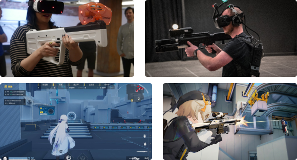
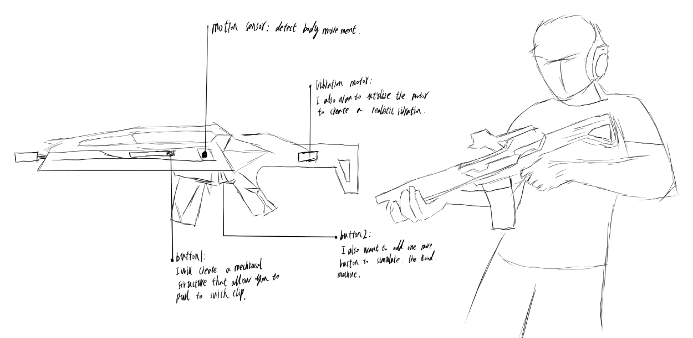
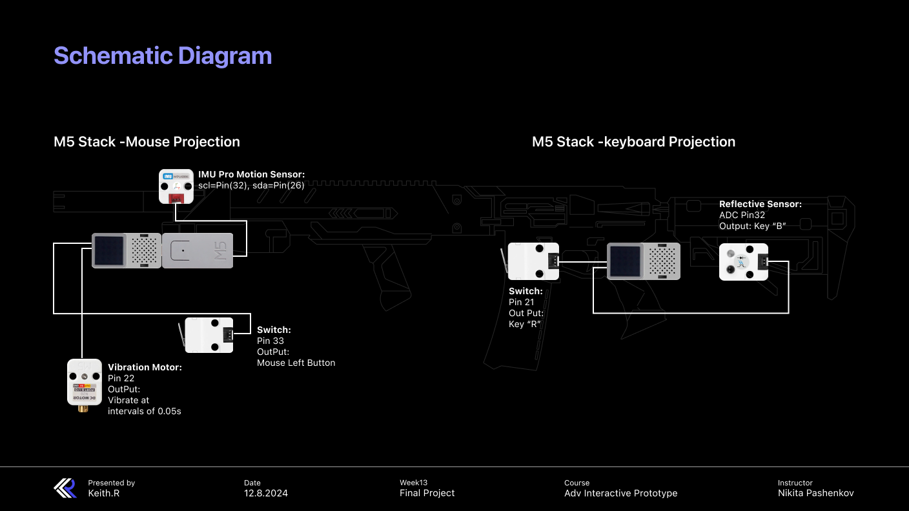
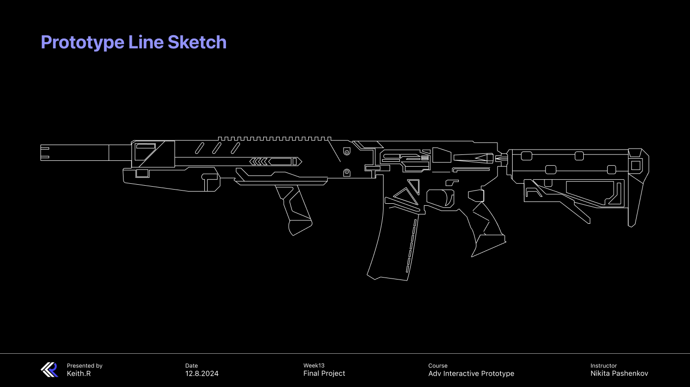
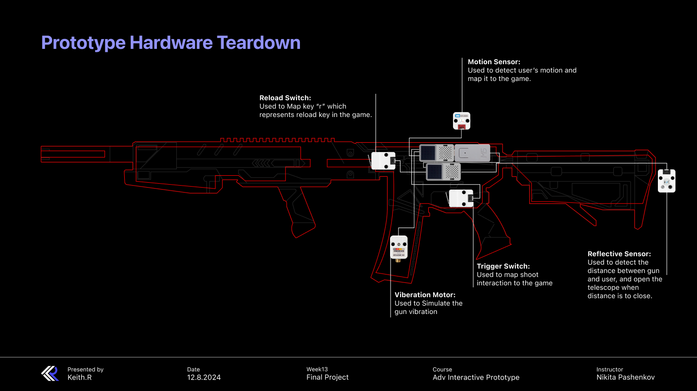
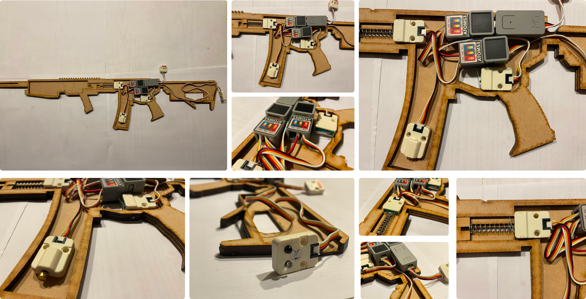

## Final Project 

Link to the code:  
[FinalProject Mouse code](Mouse.py)  
[FianlProject keyboard code](keyboard.py)     

##  Introduction


**Description**  
This project leverages a motion sensor to translate real human interactions into the game, enhancing the realism of the experience. By using the motion sensor, I can detect users' movements and synchronize them with the game character’s actions. Additionally, I aim to map interactions like reloading, shooting, and more. To heighten the immersive experience, I plan to add vibration feedback, making the gameplay even more lifelike.  

**Inspiration**  
The core of this project is to create a real immersive shooting experience. The following images demostrate how I want the final prototype to work.  

  

**Sketches：**  
  

## Implementation

**Material List:**  
Basic Material:  
MDF enclosure, MDF Reload component, Spring  
Basic Hardware:  
2 Atom Matrix/Atom S3, Extention module, 3-axis Motion Sensor, limit switch unit, reflective sensor  
Input：  
3-axis Motion Sensor, limit switch unit, reflective sensor  
Output:  
Bluetooth Mouse output, Bluetooth Keyboard output, viberation motor  

**Software:**  
Micro Phton  
Game: Project Strinova

**Description**  
To utilize bluetooth connection, we experimented with our original Atom S3 Lite borad, but it fails to esatblish a stable connection with computer. Therefore, I switched to Atom S3/Atom Matrix.  
After that, I used two limit switches to map both the reloading and shooting interactions to the game. I also set shooting as a trigger to activate the vibration motor, which continues to vibrate in a predefined cycle using PWM until the button is released.
In addition to that, I also integrated an ADC input using a reflective sensor to detect the distance between the gun and the player. When the distance is short, it triggers the “shoulder firing mode,” activating the aiming scope.  
Finally, and most importantly, I utilized an IMP Pro motion sensor to detect the player’s body movements and seamlessly project them into the game.  

##  Diagram  

**Schematic Diagram:**  

  

## Codes  

**Main code in Mouse Interaction:** 

```Python
while True:
    M5.update()
    current_time = time.ticks_ms()

    
    imu_data = imupro_0.get_accelerometer()
    acc_x = imu_data[0]  
    acc_y = imu_data[1]  
    acc_z = imu_data[2]  

    # remap to 0 - 255 range:
    #acc_x = int(m5utils.remap(acc_x, -1, 1, 0, 255))  
    #acc_y = int(m5utils.remap(acc_y, -1, 1, 0, 255))
    
    acc_x = int(m5utils.remap(acc_x, -1, 1, 10, -10))
    acc_y = int(m5utils.remap(acc_y, -1, 1, 10, -10))
    
    
    if d.mouse.get_state() is Mouse.DEVICE_CONNECTED:
        d.mouse.set_axes(int(acc_x), int(acc_y))
        d.mouse.notify_hid_report()
        time.sleep_ms(10) 
    
    if not button_pressed:
        if not button.value():
            button_pressed = True
                
            if d.mouse.get_state() is Mouse.DEVICE_CONNECTED:
                # bluetooth left mouse button press:
                d.mouse.set_buttons(1)
                d.mouse.notify_hid_report()
            
    if button_pressed:
        if button.value():
            button_pressed = False
            print('button released..')
            
            
            if d.mouse.get_state() is Mouse.DEVICE_CONNECTED:
                # bluetooth left mouse button release:
                d.mouse.set_buttons()
                d.mouse.notify_hid_report()
                
    if button_pressed:
        if time.ticks_diff(current_time, last_motortime) >= 50:  
            motor_state = not motor_state
            motor.value(1 if motor_state else 0)
            last_motortime = current_time
    else:
        motor.value(0)
        motor_state = False
```
**Code for Viberation Cycle** 

```Python       
if button_pressed:
    if time.ticks_diff(current_time, last_motortime) >= 50: 
        motor_state = not motor_state
        motor.value(1 if motor_state else 0)
        last_motortime = current_time
else:
    motor.value(0)
    motor_state = False
```

**Code for Keyboard Interaction** 

```Python       
M5.begin()
d = KeyboardDevice()

if d.keyboard.get_state() is Keyboard.DEVICE_IDLE:
    d.keyboard.start_advertising()

while True:
  M5.update()
    
  distance = adc1.read()
  distance  = int(m5utils.remap(distance, 250, 2600, 0, 100))
  
 
  if not reload_key:
    if not button2.value():
      reload_key = True
      print('button2 pressed..')
      if d.keyboard.get_state() is Keyboard.DEVICE_CONNECTED:
          # send key press:
          #d.keyboard.set_keys(0x04)  # 'a'
          char_code = 0x04 + ord('r') - ord('a')  # get code for 'r'
          d.keyboard.set_keys(char_code)
          d.keyboard.notify_hid_report()
          time.sleep_ms(2)

  if reload_key:
    if button2.value():
      reload_key = False
      print('button2 released..')
      if d.keyboard.get_state() is Keyboard.DEVICE_CONNECTED:
        # send key release:
        d.keyboard.set_keys()
        d.keyboard.notify_hid_report()
        time.sleep_ms(2)

 
  time.sleep_ms(100)  # temporary delay REMOVE later
  
  if lens_key == False:
    if distance < 10:
      lens_key = True
      print('button2 pressed..')
      if d.keyboard.get_state() is Keyboard.DEVICE_CONNECTED:
          # send key press:
          char_code = 0x05
          d.keyboard.set_keys(char_code)
          d.keyboard.notify_hid_report()
          time.sleep_ms(2)

  if lens_key == True:
    if not distance < 10:
      lens_key = False
      print('button2 released..')
      if d.keyboard.get_state() is Keyboard.DEVICE_CONNECTED:
        # send key release:
        d.keyboard.set_keys()
        d.keyboard.notify_hid_report()
        time.sleep_ms(2)
```
## Integrations & Connection

The core of this project is to utilize the bluetooth to create connection between prototype and the game on a PC to map human interaction into the game.  Therefore, following code is applied to my prototype to establsh this connection:

**Bluetooth for Keyboard Projection**  
[BluetoothKeyboard](BluetoothKeyboard.py)  

**Bluetooth for Mouse Projection**  
[BluetoothMouse](BluetoothMouse.py)  

## Enclosure Design:  
**Prototype Line Sketch:**  

  

**Prototype Teardown:**  

  

##  Prototyping Process  

  


## Final Prototype Demo:  

**Demo Images**


**link to demo Video:**  
https://drive.google.com/file/d/19_AIDiYw_o4snVoypcmCBq1djsGoEjB8/view?usp=share_link  

## Conclusion:  
During this class, we experimented with a variety of hardware and software, ranging from something as simple as a light with two stages (on and off) to more complex tasks like servo control, ADC control, connecting with p5.js, establishing Bluetooth connections, and Wi-Fi connections. In this final project, I aimed to implement everything I learned during previous classes, including ADC, PWM, and more. Additionally, with help from Nikita, I was able to use a Bluetooth connection to successfully map all human interactions into a virtual game.  This class provides me a very unique and precious opportunity to play with code and hardware，allowing me to gain foundational insights into embedded development world.

This final project is more than just a simple prototype; it also explores how the future of gaming experiences could evolve. By integrating a physical object with VR or MR technology, the gaming experience can be elevated to an entirely new level.
