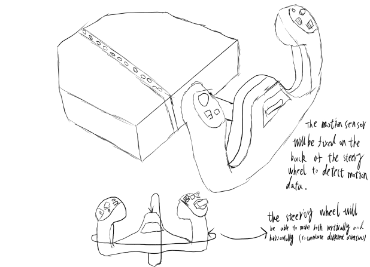
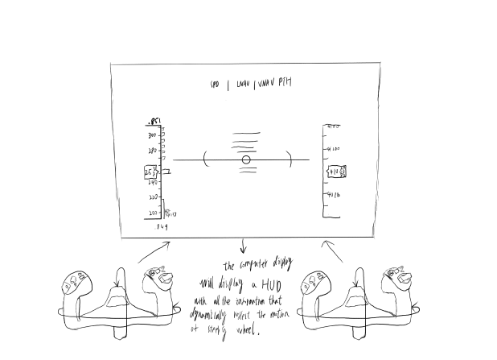
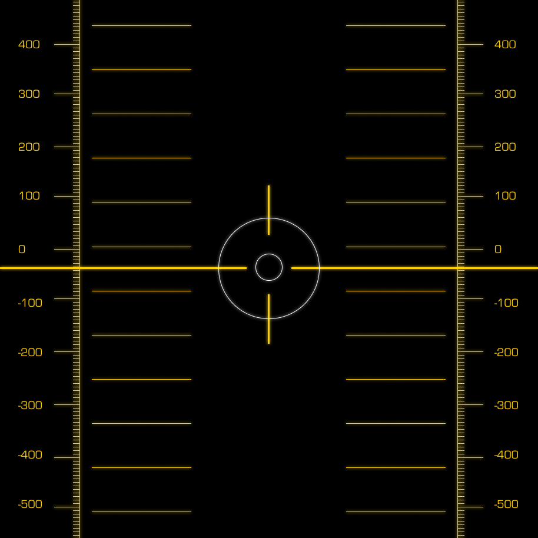
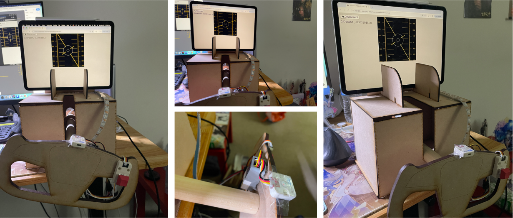

## Assignment2  

Link to the code:  
[assignment2 Micropyton code](main.py)  
[assignment2 Python code](main.py)     


**Description**  
This project aims to create an immersive flighting experience. The project integrates a motion sensor mounted on a steering wheel to provide motion data displayed on a HUD on a computer screen. A switch on the steering wheel connects to an RGB strip, and pressing the button triggers a gunfire animation on the lights. The setup combines motion tracking with interactive lighting for an immersive experience.  

**Inspiration**  
The core of this project is to use a motion sensor to simulate the experience of flying a fighter jet. A HUD will display key information such as altitude, direction, and other essential data. This setup aims to create a realistic and immersive flight experience.  

  

**Sketches：**  
  


**Material List:**  
Basic Material:  
MDF  
Basic Hardware:  
ESP 32, Extention module, wires  
Input：  
3-axis Motion Sensor, button  
Output:  
P5js, HTML&CSS, iPad display, LED lights 

**Graphic Elements Used**  

  
[activated](activated.png)
[centerhorizontal](centerhorizontal.png)
[centervertical](centervertical.png)
[centerhorizontal](centerhorizontal.png)
[largecircle](largecircle.png)
[leftcontrol](leftcontrol.png)
[leftcontrol2](leftcontrol2.png)
[rightcontrol](rightcontrol.png)
[rightcontrol1](rightcontrol1.png)
[rightcontrol2](rightcontrol2.png)
[smallcircle](smallcircle.png)


**Flowchart of high-level logic:**  
  


**Main code in the micro python:** 

```Python
while True:
  M5.update()
  imu_data = imupro_0.get_accelerometer()
  acc_x = imu_data[0] #Xacceleration value
  acc_y = imu_data[1]#yacceleration value
  acc_z = imu_data[2]#zacceleration value
  if not button.value():
      button_pressed = 1
  elif button.value():
      button_pressed = 0
      
  if button_pressed == 1 and led < 29:
    led += 1
    rgb_strip.set_color(led,0xff0000)
  elif led > 0 and button_pressed == 0:
    
    rgb_strip.set_color(led, 0x000000)  # 关闭对应的LED
    led  -= 1
    #rgb_strip.write()
    
  if led == 29:
    activate = 1
  else:
    activate = 0
  print(acc_x,',', acc_y,',',activate)
  time.sleep_ms(50)
```


**Code snipped for draw function in the program:** 

```Python
def draw():
  global acc_x, acc_x_last
  global acc_y, acc_y_last
  global controls_speed_x, controls_speed_y
  global controls_y
  global rotate_speed
  global rotate_angle
  global circle_x, circle_y, controls_x, activated
  global activated_prev, activated_time


  p5.background(0)

  data = document.getElementById("data").innerText
  
  # assign content of "data" div on index.html page to variable:
  data_string = document.getElementById("data").innerText

  # split data_string by comma, making a list:
  data_list = data_string.split(',')

  p5.fill(255)
  # p5.text(data_list[0], 10, 20)
  # p5.text(data_list[1], 10, 32)

  # p5.text('circle_x = ' + str(circle_x), 10, 44)
  # p5.text('circle_y = ' + str(circle_y), 10, 56)

  # p5.text('controls_speed_y = ' + str(controls_speed_y), 10, 68)

  
  controls_speed_x = float(data_list[0])
  controls_speed_x = p5.map(controls_speed_x, -1.0, 1.0, -3.0, 3.0)

  controls_speed_y = float(data_list[1])
  controls_speed_y = p5.map(controls_speed_y, -1.0, 1.0, -3.0, 3.0)

  rotate_speed = float(data_list[0])
  rotate_speed = p5.map(rotate_speed, -1.0, 1.0, -0.05, 0.05)

  activated = float(data_list[2])
  #controls_x += controls_speed_x


  if activated_prev == 0 and activated == 1:
    activated_time = p5.millis()  

  activated_prev = activated 
  


  
  
  
  update_controls()

  #draw small circle
  p5.push()
  #p5.translate(controls_x, controls_y)
  p5.translate(p5.width/2, p5.height/2)
  p5.translate(circle_x, circle_y)
  p5.image(smallcircle, 0, 0,smallcircle.width*0.5, smallcircle.height*0.5)
  p5.pop()

  p5.translate(p5.width/2, p5.height/2)

  #Draw rightline
  p5.push()
  p5.translate(-120, controls_y)
  p5.image(img1, 0, 0,img1.width*0.5, img1.height*0.5)
  p5.pop()

  #Draw left line2
  p5.push()
  p5.translate(-60, controls_y*0.25)
  p5.image(img3, 0, 0,img3.width*0.3, img3.height*0.5)
  p5.pop()
  
  #Draw rightline1
  p5.push()
  p5.translate(60, controls_y*0.25)
  p5.image(img4, 0, 0,img4.width*0.3, img4.height*0.5)
  p5.pop()
  
  #draw rightline 2
  p5.push()
  p5.translate(120, controls_y)
  p5.image(img2, 0, 0,img2.width*0.5, img2.height*0.5)
  p5.pop()
  
  p5.push()
  p5.rotate(rotate_angle)

  #draw centerline vertical
  p5.push()
  p5.translate(0, 0)
  p5.image(centerlinevertical, 0, 0,centerlinevertical.width*0.5, centerlinevertical.height*0.5)
  p5.pop()

   #draw centerline horizontal
  p5.push()
  p5.translate(0, 0)
  p5.image(centerlinehorizontal, 0, 0, centerlinehorizontal.width*0.5, centerlinehorizontal.height*0.5)
  p5.pop()
  p5.pop()

  

  #draw big circle
  p5.push()
  p5.translate(0, 0)
  p5.image(largecircle, 0, 0,largecircle.width*0.5, largecircle.height*0.5)
  p5.pop()

  current_time = p5.millis() - activated_time

  # p5.push()
  # p5.translate(0, 0)
  # p5.image(redborder, 0, 0, redborder.width*0.33, redborder.height*0.33)
  # p5.pop()

  if current_time < 1000:
      if int(current_time / 200) % 2 == 0:
        p5.push()
        p5.image(redborder, 0, 0, redborder.width*0.33, redborder.height*0.33)
        p5.pop()

  

def update_controls():
  global controls_speed_y
  global controls_y
  global rotate_speed
  global rotate_angle, controls_x
  global circle_x, circle_y


  if (p5.abs(controls_speed_x) < 0.5):
    if (circle_x < 0):
      circle_x += 1
    elif (circle_x > 0):
      circle_x -= 1

  if (p5.abs(controls_speed_y) < 0.5):
    if (circle_y < 0):
      circle_y += 1
    elif (circle_y > 0):
      circle_y -= 1

  else:

    if (controls_speed_y > 0) and (controls_y < 150):
        controls_y += controls_speed_y
        circle_y += controls_speed_y
        
    if (controls_speed_x > 0) and (controls_x < 150):
        controls_x += controls_speed_x
        circle_x += controls_speed_x

    if (controls_speed_y < 0) and (controls_y > -150):
      controls_y += controls_speed_y
      circle_y += controls_speed_y
      
    if (controls_speed_x < 0) and (controls_x > -150):
      controls_x += controls_speed_x
      circle_x += controls_speed_x

  if (rotate_speed > 0):
    if (rotate_angle < 1):
      rotate_angle += rotate_speed
  elif (rotate_speed < 0) and (rotate_angle > -1):
    rotate_angle += rotate_speed
```

**Images of Prototype:**


**link to demo Video:**  
https://drive.google.com/file/d/19_AIDiYw_o4snVoypcmCBq1djsGoEjB8/view?usp=share_link

