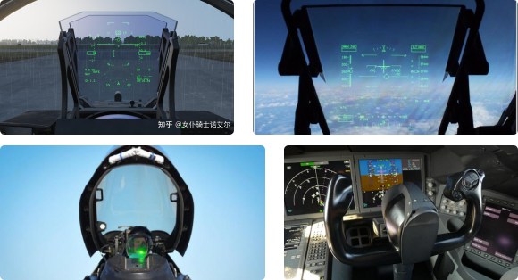

## Assignment2  
Link to the code:  
[assignment2 Micropyton code](main.py)  
[assignment2 P5.js code](main.py)     
**Description**  
This project aims to create a immersive flighting experience. The project integrates a motion sensor mounted on a steering wheel to provide motion data displayed on a HUD on a computer screen. A switch on the steering wheel connects to an RGB strip, and pressing the button triggers a gunfire animation on the lights. The setup combines motion tracking with interactive lighting for an immersive experience.  

**Inspiration**  
The core of this project is to use a motion sensor to simulate the experience of flying a fighter jet. A HUD will display key information such as altitude, direction, and other essential data. This setup aims to create a realistic and immersive flight experience.  



**Sketches：**  


**Material List:**  
Basic Material:  
MDF, Books  
Basic Hardware:  
ESP 32, Bread board, conductive tape, wires  
Input：  
Books(with conductive tape)  
OutPut:  
LED lights 

**Flowchart of high level logic:**   


**Code snipped for definitions in the program:** 

```Python
def get_rgb_color(r, g, b):
    rgb_color = (r << 16) | (g << 8) | b
    return rgb_color

def rgb_blink_red():
    rgb2.fill_color(get_rgb_color(255, 0, 0))
    time.sleep_ms(500)
    rgb2.fill_color(get_rgb_color(0, 0, 0))
    time.sleep_ms(500)

def rgb_cycle_colors():
    while not pin5.value() and not pin7.value():
        for i in range(256):
            if pin5.value() or pin7.value():
                return
            rgb2.fill_color(get_rgb_color(0, i, 255 - i))
            time.sleep_ms(10)
        for i in range(256):
            if pin5.value() or pin7.value():
                return
            rgb2.fill_color(get_rgb_color(i, 255, 0))
            time.sleep_ms(10)
        for i in range(256):
            if pin5.value() or pin7.value():
                return
            rgb2.fill_color(get_rgb_color(255 - i, 255 - i, i))
            time.sleep_ms(10)
```

**Main code in the program:** 
```Python
while True:
    M5.update()

    if not pin5.value() and program_state == 'inactive':
        program_state = 'active'
        print('active')
       

    if program_state == 'active':
        input_pin5_active = not pin5.value()
        input_pin7_active = not pin7.value()

        if input_pin5_active and input_pin7_active:
            pin6.off()
            pin8.off()
            rgb_cycle_colors()
        elif input_pin5_active or input_pin7_active:
            pin6.on()
            pin8.off()
            rgb_blink_red() 
            pin6.off()
            pin8.on()
            rgb_blink_red()
        else:
            pin6.on()   
            pin8.off()
            rgb2.fill((0, 0, 0))
    else:
        pin6.off()
        pin8.off()
        rgb2.fill((0, 0, 0))

    time.sleep_ms(10)
```
**Images of Prototype:**


**link to demo Video:**  
https://drive.google.com/file/d/1uqaur7JPG99CNawr7ctLzb1RcDJ87BxB/view?usp=share_link


